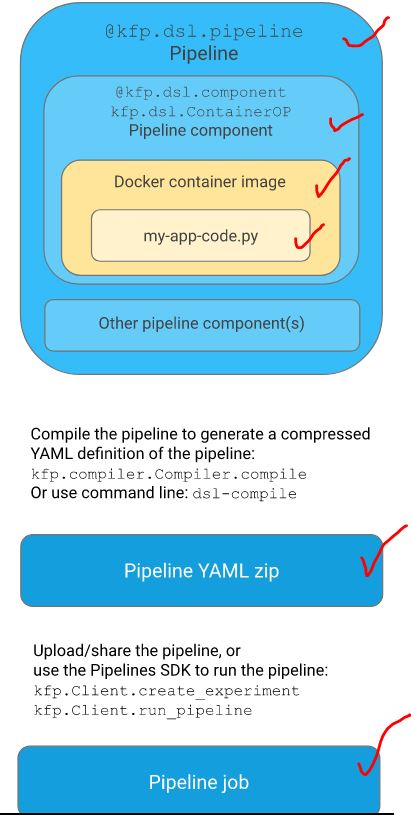
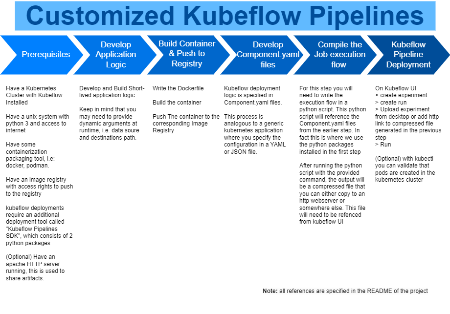

## FLOW

 pipeline setup

 


 Another way to visualize the pipeline setup

 


## 0. PREREQUISITES

 a. Kubernetes cluster
 b. Kubeflow installed on Kubernetes Cluster
 c. Docker
```bash
docker --version
```
 d. Pyhton3 and Python Package Manager (pip3)
```bash
python3 --version # (tested on python 3.6.8)
pip3 --version # 
```
e. SDK
```bash
pip3 install kfp==1.8.0 # only works for V1 API for now
pip3 install requests
pip3 install kfp-server-api 
```

## 1. APPLICATION LOGIC

Write the program that contains your component's logic. The program must use files and command-line arguments to pass data to and from the componentent. 

```bash
cat ./my_pipeline/transformation_1/transform_1.py
cat ./my_pipeline/transformation_2/transform_2.py
```

## 2. BULD AND PUSH TO IMAGE REGISTRY

Containerize the program.

a. Dockerfile
```bash
cat ./my_pipeline/transformation_1/Dockerfile
cat ./my_pipeline/transformation_2/Dockerfile
```

b. build images
```bash
docker build -t darianharrison89/my-transform1:0.0.0 --build-arg http_proxy=http://web-proxy.corp.hpecorp.net:8080 --build-arg HTTPS_PROXY=http://web-proxy.corp.hpecorp.net:8080 ./my_pipeline/transformation_1/
# docker build -t darianharrison89/my-pipeline:0.0.0 ./my_pipeline/transformation_1/

docker build -t darianharrison89/my-transform2:0.0.0 --build-arg http_proxy=http://web-proxy.corp.hpecorp.net:8080 --build-arg HTTPS_PROXY=http://web-proxy.corp.hpecorp.net:8080 ./my_pipeline/transformation_2/
# docker build -t darianharrison89/my-pipeline:0.0.0 ./my_pipeline/transformation_2/
```

c. push new pipeline images
```bash
docker push darianharrison89/my-transform1:0.0.0
docker push darianharrison89/my-transform2:0.0.0
```

## 3. DEVELOP COMPONENTS.YAML

a. Use the Kubeflow Pipelines SDK to load your component, use it in a pipeline and run that pipeline.

```bash
cat ./my_pipeline/transformation_1/component.yaml
cat ./my_pipeline/transformation_2/component.yaml
```

b.  Write a component specification in YAML format that describes the component for the Kubeflow Pipelines system.
```bash
cat ./my_pipeline/pipeline.py
```


## 4. COMPILE THE JOB EXECUTION DAG

Compile the pipeline to generate a compressed YAML definition of the pipeline. 

a. compile and serve pipeline
```bash
dsl-compile --py ./my_pipeline/pipeline.py --output my-pipeline-0.0.0.tar.gz
ls
# cp my-pipeline-0.0.0.tar.gz /var/www/html/staticfiles (optional)
```

## 5. RUN PIPELINE ON UI

Test, Use the Kubeflow Pipelines SDK to run the pipeline

a. on UI

to execute, simply do 
```
> create experiment
> create pipeline > upload compressed file or paste http:// reference
> Create Run > Choose experiment
> run pipieline
```

b. on k8s master you can verify
```
k get all -n <my-kubeflow-namespace>
```
